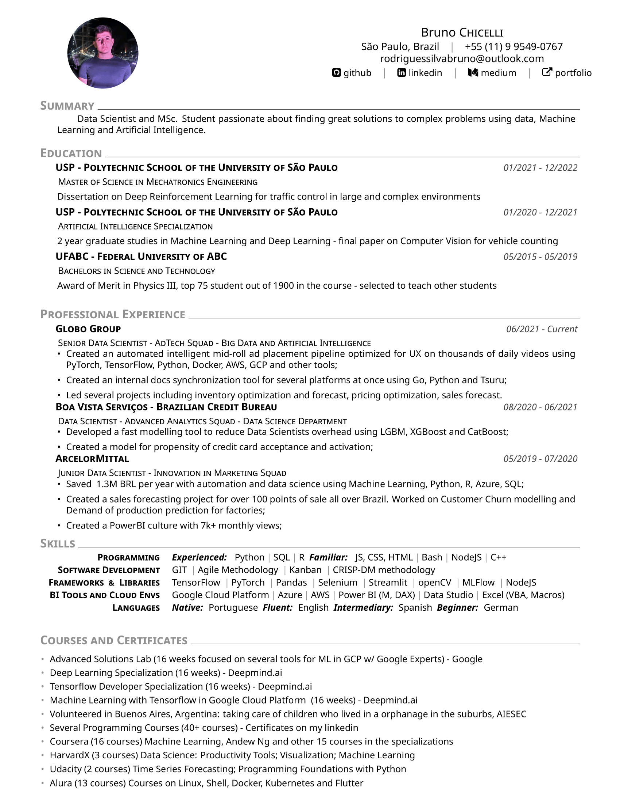

# Curriculum Vitae - Bruno Rodrigues Silva

This is my official CV. <br>
It's based on the template available on Overleaf created by Murat Can Karacabey.
## Preview 
<p align="center">
  
</p>
## How to use it

On Windows
```
git clone https://github.com/brunorosilva/CV-BRS.git
del /f CV-BRS\README.md
del /f CV-BRS\Bruno_Rodrigues_CV.pdf
del /f CV-BRS\images\CV.png
```

Now zip the CV-BRS folder and upload it to <a href='https://www.overleaf.com/'>Overleaf</a>.

---

On Linux
```bash
git clone https://github.com/brunorosilva/CV-BRS.git
rm CV-BRS/README.md
rm CV-BRS/Bruno_Rodrigues_CV.pdf
rm CV-BRS/images/CV.png
rm -rf CV-BRS/.git
zip -r My-CV.zip CV-BRS
```
Now upload the zip file to <a href='https://www.overleaf.com/'>Overleaf</a>.

---

It is important that you change the compiler to XeLaTex by going into the project on Overleaf, clicking on menu (top left corner) and selecting XeLaTex as the compiler. 
